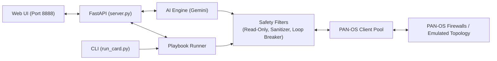

# Core Defense

AI-powered security operations and automation engine for Palo Alto Networks (PAN-OS) firewalls.

Core Defense connects Google Gemini to your PAN-OS firewalls (or runs in offline emulation mode). It automates routine firewall auditing, runs background threat-hunting playbooks, lets you query live firewall state using natural language, and visualizes network topology and attack paths.

---

## What It Does

- **Automated Security Playbooks**: 19 scheduled routines checking for policy drift, split-brain HA, lateral movement, and uninspected permit rules.
- **Natural Language Firewall Assistant**: Ask questions like *"Can 10.0.0.5 reach 8.8.8.8 on port 443?"* or *"Show me denied traffic in the last hour"*. The AI queries the firewall using 85 validated tools and returns structured evidence.
- **Network Topology & Attack Simulation**: Parses firewall XML to draw live network diagrams (zones, subnets, interfaces) and simulates adversary traversal paths against your security policies.
- **Built-in Safety Controls**: Runs in `READ_ONLY` mode by default. Destructive CLI commands (`reboot`, `commit`, `wipe`) are blocked before hitting the firewall. Spending guards cap API costs.
- **Offline / Emulation Mode**: Works even without live hardware by emulating the dataplane using saved configuration topology.

---

## Quick Start

### 1. Install

Requirements: Python 3.11+, a PAN-OS firewall (or use offline mode), and a Gemini API key.

```bash
git clone https://github.com/FUEL-user-community/firewall-ai.git
cd firewall-ai

python -m venv venv
# Windows:
venv\Scripts\activate
# Linux/macOS:
source venv/bin/activate

pip install -r requirements.txt
cp .env.example .env
```

### 2. Configure `.env`

```env
PANOS_HOSTNAME=192.168.1.254
PANOS_API_KEY=your-panos-api-key
GEMINI_API_KEY=your-gemini-api-key
```

*(If you don't have a live firewall, leave `PANOS_HOSTNAME` as-is. The system will automatically fall back to offline emulation mode.)*

### 3. Verify & Run

```bash
# Pre-flight check (verifies credentials, fleet devices, and playbooks)
python server.py --check

# Start the web console
python server.py
```

Open **`http://localhost:8888`** in your browser.

---

## CLI Usage

Run inspection playbooks directly from the terminal without starting the web server:

```bash
# List all 19 playbooks
python scripts/run_card.py --list

# Run a specific playbook against the default firewall
python scripts/run_card.py operational_resilience

# Run by playbook ID
python scripts/run_card.py FT-01

# Run against a specific firewall from config/devices.yaml
python scripts/run_card.py FT-01 --device fw-hq

# Run all playbooks sequentially
python scripts/run_card.py all
```

---

## Configuration

All configuration files live in `config/`:

| File | Purpose |
| :--- | :--- |
| `config/devices.yaml` | List of firewalls (IPs, aliases, default target). |
| `config/health_rules.yaml` | Plain-English health check rules, thresholds, and fleet overrides. |
| `config/cards.yaml` | Definitions for the 19 automated inspection playbooks. |
| `config/commands.yaml` | Allowed PAN-OS operational commands and tool mappings. |
| `config/prompts.yaml` | Core AI system prompts and reasoning rules. |
| `config/range_prompts.yaml` | Prompts for attack simulation and Mermaid diagram generation. |

### Multi-Firewall Setup (`config/devices.yaml`)

```yaml
firewalls:
  fw-hq:
    ip: 192.168.1.254
    label: "HQ Perimeter Firewall"
    default: true

  fw-branch:
    ip: 10.0.0.1
    label: "Branch Office Firewall"
```

To provide API keys per device, add them to `.env`:
```env
PANOS_API_KEY_FW_HQ=your-key-1
PANOS_API_KEY_FW_BRANCH=your-key-2
```

### Health Check Rules & Fleet Overrides (`config/health_rules.yaml`)

Health thresholds are declared in `config/health_rules.yaml` with plain-English descriptions (no Python coding required):

- **Fleet Baseline**: Top-level thresholds apply to every firewall in your fleet automatically.
- **Partition-Smart Storage**: System partitions (`/`, `/opt/pancfg`) alert at 85%/95% to protect the OS and commits. Log partitions (`/opt/panlogs`) alert at 92%/97% because PAN-OS automatically purges old logs at ~90–95% quota.
- **Per-Device Fleet Overrides**: Set custom thresholds for individual firewalls (e.g. lab firewalls that reboot often, or virtual PA-VMs) under `device_overrides`:

```yaml
# config/health_rules.yaml
uptime:
  warn_if_under_hours: 12

cpu:
  load_per_core_caution: 0.75
  load_per_core_critical: 1.50

storage:
  system_partitions:
    caution_pct: 85
    critical_pct: 95
  log_partitions:
    caution_pct: 92
    critical_pct: 97

# Optional per-device overrides:
device_overrides:
  fw-lab:
    uptime:
      warn_if_under_hours: 1    # Lab firewalls reboot often; don't alert after 1h
    cpu:
      load_per_core_caution: 1.20
```

---

## Architecture



---

## License

MIT License. See [LICENSE](LICENSE).
